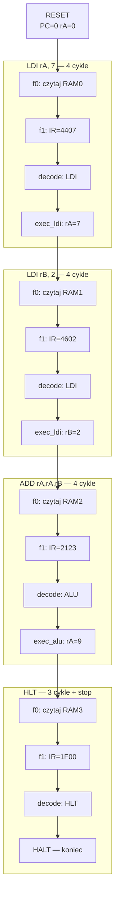

# Jak działa nasz procesor — krok po kroku

Materiał do zrozumienia i prezentacji na zajęciach. Opisuje **co się dzieje od resecie do końca programu** w naszym projekcie.

---

## 1. Z czego składa się procesor?

Procesor to nie jeden blok — to **kilka współpracujących modułów**:

```
┌──────────────────────────────────────────────────────────────┐
│                         CPU.vhd (top)                        │
│                                                              │
│   ┌──────────┐    sygnały sterujące    ┌──────────────┐       │
│   │ control  │ ──────────────────────►│ register_cpu │       │
│   │  (mózg)  │◄── IR, flagi Z         │  (rejestry)  │       │
│   └──────────┘                        └──────┬───────┘       │
│         │                              BB, BC │ ADR          │
│         │                                     ▼               │
│         │                              ┌──────────┐           │
│         └─────────────────────────────►│   ALU    │           │
│              kod operacji Salu           └────┬─────┘           │
│                                               │ alu_Y          │
│   ┌──────────┐         szyna D         ┌─────▼─────┐          │
│   │   RAM    │◄───────────────────────►│  busint   │          │
│   │ (program)│                         │ MAR/MBR   │          │
│   └──────────┘                         └───────────┘          │
└──────────────────────────────────────────────────────────────┘
```

| Moduł | Rola (mówisz na zajęciach) |
|-------|---------------------------|
| **RAM** | Przechowuje **program** (instrukcje) i dane |
| **control** | **Mózg** — wie, w którym kroku jesteśmy i co włączyć |
| **register_cpu** | **Pamięć szybka** — rA, rB, PC, IR itd. |
| **ALU** | **Kalkulator** — dodaje, odejmuje, logiczne operacje |
| **busint** | **Tłumacz** między procesorem a RAM (adres + dane) |

---

## 2. Najważniejsze rejestry (co warto zapamiętać)

| Rejestr | Po co jest |
|---------|------------|
| **PC** (Program Counter) | Wskazuje **adres następnej instrukcji** w RAM |
| **IR** (Instruction Register) | Trzyma **aktualnie wykonywaną instrukcję** (16 bitów) |
| **rA, rB** | Rejestry ogólnego przeznaczenia — tu trafiają wyniki |
| **AD** | Rejestr adresowy — np. przy LOAD/STORE |

Po **resecie** (KEY[1]): PC = 0, rA = 0, rB = 0, IR = 0, stan = f0.

---

## 3. Jak wygląda jedna instrukcja? (cykl życia)

Każda instrukcja przechodzi przez **4 fazy** (wyjątki: LOAD/STORE mają więcej):


| Faza | Stan (HEX5) | Co się dzieje |
|------|-------------|---------------|
| **f0** | `0` | PC wystawiony na adres RAM → odczyt słowa → **PC = PC + 1** |
| **f1** | `1` | Słowo z RAM trafia do **IR** |
| **decode** | `2` | Sprawdzenie IR[15:13] — jaki to typ? (LDI, ADD, HLT…) |
| **execute** | `3`/`4`/… | Właściwe działanie (ALU, stała, skok…) |
| powrót | `0` | Następna instrukcja pod adresem PC |

**1 kliknięcie KEY[0] = 1 faza = 1 przejście maszyny stanów.**

---

## 4. Program w pamięci (nasz przykład)

Plik `ram_init.mif` ładuje do RAM:

| Adres (PC) | Kod hex | Instrukcja | Co robi |
|------------|---------|------------|---------|
| 0 | `4407` | LDI rA, 7 | rA ← 7 |
| 1 | `4602` | LDI rB, 2 | rB ← 2 |
| 2 | `2123` | ADD rA, rA, rB | rA ← rA + rB |
| 3 | `1F00` | HLT | Zatrzymaj procesor |

---

## 5. Pełna ścieżka od resetu do HLT

### Krok 0 — Reset (KEY[1])

| Element | Wartość |
|---------|---------|
| PC | 0 |
| rA, rB | 0 |
| IR | 0 |
| Stan | f0 |
| HEX (rA) | 0000 |

Procesor **czeka** na pierwszy impuls zegara. Sam nic nie robi.

---

### Instrukcja 1: `LDI rA, 7` (adres 0, kod `4407`)

**Rozkodowanie instrukcji:**
- `010` = typ LDI
- `dddd` = `0010` = rejestr **rA**
- `iiiiiiii` = `00000111` = stała **7**

#### Cykl po cyklu (4× KEY[0])

| Klik | Stan | Co robi procesor | PC po | rA po |
|------|------|------------------|-------|-------|
| 1 | f0→f1 | Adres = PC(0), odczyt RAM[`0000`]=`4407`, PC++ | 1 | 0 |
| 2 | f1→decode | Wartość `4407` zapisana do **IR** | 1 | 0 |
| 3 | decode→exec_ldi | Rozpoznano: to LDI | 1 | 0 |
| 4 | exec_ldi→f0 | Stała 7 z IR[7:0] → **rA = 7** | 1 | **7** |

**Co się dzieje w exec_ldi (technicznie):**
1. `IR[7:0]` = 7 trafia na szynę **DI** (multiplekser w CPU.vhd).
2. ALU robi **DI + 0** (ADD z TMP=0).
3. Wynik (7) zapisywany do **rA** przez sygnał Sba.

---

### Instrukcja 2: `LDI rB, 2` (adres 1, kod `4602`)

| Klik | Stan | Co robi procesor | PC po | rB po |
|------|------|------------------|-------|-------|
| 5 | f0→f1 | Odczyt RAM[1]=`4602`, PC++ | 2 | 0 |
| 6 | f1→decode | IR = `4602` | 2 | 0 |
| 7 | decode→exec_ldi | Typ LDI | 2 | 0 |
| 8 | exec_ldi→f0 | **rB = 2** | 2 | **2** |

rA nadal = 7.

---

### Instrukcja 3: `ADD rA, rA, rB` (adres 2, kod `2123`)

**Rozkodowanie:**
- `001` = operacja ALU
- `ooooo` = `00010` = **ADD**
- `dddd` = `0010` = **rA** (argument 1 i cel)
- `ssss` = `0011` = **rB** (argument 2)

| Klik | Stan | Co robi procesor | PC po | rA po |
|------|------|------------------|-------|-------|
| 9 | f0→f1 | Odczyt RAM[2]=`2123`, PC++ | 3 | 7 |
| 10 | f1→decode | IR = `2123` | 3 | 7 |
| 11 | decode→exec_alu | Typ ALU — ADD | 3 | 7 |
| 12 | exec_alu→f0 | ALU: 7+2=**9** → zapis do **rA** | 3 | **9** |

**Co się dzieje w exec_alu:**
1. Rejestry: **BB ← rA** (7), **BC ← rB** (2).
2. ALU: operacja ADD → wynik **9**.
3. Wynik zapisywany z powrotem do **rA**.

---

### Instrukcja 4: `HLT` (adres 3, kod `1F00`)

| Klik | Stan | Co robi procesor | PC po |
|------|------|------------------|-------|
| 13 | f0→f1 | Odczyt RAM[3]=`1F00`, PC++ | 4 |
| 14 | f1→decode | IR = `1F00` | 4 |
| 15 | decode→**halt** | IR[15:13]=`000` i IR[12:8]=`11111` → **HLT** | 4 |
| 16+ | **halt** | Procesor **stoi** — dalsze kliknięcia nic nie zmieniają | 4 |

**Końcowy stan:**

| Element | Wartość |
|---------|---------|
| rA | **9** |
| rB | 2 |
| PC | 4 |
| IR | 1F00 |
| Stan | **1111 (HLT)** |
| HEX (SW=00) | **0009** |

---

## 6. Diagram przepływu całego programu



---

## 7. Co robi każdy moduł w trakcie? (ścieżki danych)

### FETCH (f0 + f1) — „Pobierz instrukcję”

```
PC ──► ADR (rejestry) ──► busint ──► adres RAM
RAM ──► szyna D ──► busint.DI ──► (f1) ──► IR
```

1. **PC** podawany na szynę adresową.
2. **RAM** zwraca 16-bitowe słowo (np. `4407`).
3. W **f1** słowo trafia do **IR**.

### LDI — „Wpisz stałą do rejestru”

```
IR[7:0] ──► DI ──► ALU (DI+0) ──► wynik ──► rejestr docelowy
```

Stała jest **w samej instrukcji** (8 dolnych bitów IR).

### ADD (ALU) — „Oblicz i zapisz”

```
rA ──► BB ──┐
            ├──► ALU (ADD) ──► wynik ──► rA
rB ──► BC ──┘
```

### HLT — „Koniec”

Jednostka sterująca przechodzi w stan **halt** i nie wraca do f0 (dopóki nie zrobisz resetu).

---

## 8. Multipleksery w CPU.vhd (ważne na prezentacji)

Top-level ma **3 przełączniki** (mux), które łączą moduły:

| Mux | Wybór | Po co |
|-----|-------|-------|
| **DI** | Zawsze `IR[7:0]` | Stała 8-bit dla LDI i adresów |
| **BA** | `MIO=0` → ALU, `MIO=1` → RAM | Do IR idą dane z pamięci; do rejestru wynik ALU |
| **Szyna D** | Przy odczycie: `RAM → busint` | Połączenie RAM z resztą układu |

Bez tych muxów moduły byłyby podłączone, ale **nie współpracowałyby** jak procesor.

---

## 9. Format instrukcji (ściąga na zajęcia)

```
Bit:  15 14 13 | 12 ... 8 | 7  6  5  4 | 3  2  1  0
      ─────────┼──────────┼────────────┼────────────
      TYP (3b) | zależy   | pole 1     | pole 2
```

| IR[15:13] | Nazwa | Znaczenie pól |
|-----------|-------|---------------|
| `000` | NOP/HLT | `11111` w [12:8] = HLT |
| `001` | ALU | [12:8]=kod operacji, [7:4]=rejestr docelowy, [3:0]=źródło |
| `010` | LDI | [12:9]=rejestr, [7:0]=stała 8-bit |
| `011` | LOAD | [12:9]=rejestr, [7:0]=adres w RAM |
| `100` | STORE | [12:9]=rejestr źródło, [7:0]=adres |
| `101` | JMP | [7:0]=nowy adres PC |
| `110` | BRZ | skok jeśli flaga Z=1 |

**Kody rejestrów:** rA=`0010`, rB=`0011`, rC=`0100`.

---

## 10. Jak to powiedzieć na zajęciach (30-sekundowa wersja)

> „Nasz procesor ma program w pamięci RAM. Po resecie licznik PC wskazuje adres 0.  
> Każde kliknięcie zegara to jeden krok maszyny stanów.  
> Najpierw **pobieramy** instrukcję z RAM do rejestru IR, potem ją **rozpoznajemy**,  
> potem **wykonujemy** — np. LDI wpisuje stałą, ADD liczy w ALU.  
> W naszym programie: wpisujemy 7 do rA, 2 do rB, dodajemy i dostajemy 9.  
> Na końcu instrukcja HLT zatrzymuje procesor — na HEX widać 0009.”

---

## 11. Jak to powiedzieć na zajęciach (2-minutowa wersja)

1. **Architektura:** RAM + control + rejestry + ALU + busint — klasyczna organizacja von Neumanna (program w tej samej pamięci co dane).

2. **Cykl instrukcji:** fetch → decode → execute — powtarza się w pętli, dopóki nie ma HLT.

3. **Demonstracja:** reset → 16 kliknięć KEY[0] → HEX pokazuje 9 → LEDR pokazuje stan HLT.

4. **LDI vs ADD:** LDI bierze liczbę z samej instrukcji (8 bitów). ADD bierze liczby z rejestrów rA i rB przez ALU.

5. **PC:** po każdym fetchu rośnie o 1 — dlatego na końcu PC=4 (pobrano 4 instrukcje).

---

## 12. Pytania, które mogą paść na zajęciach

| Pytanie | Odpowiedź |
|---------|-----------|
| Skąd procesor wie, co wykonać? | Z **IR** — tam jest kod instrukcji pobrany z RAM. |
| Kto decyduje o kolejnych krokach? | **control** — maszyna stanów (f0, f1, decode, execute…). |
| Gdzie jest program? | W **RAM**, załadowany z `ram_init.mif` przy kompilacji. |
| Co robi KEY[0]? | Daje **impuls zegara** — jeden krok stanu. |
| Co robi KEY[1]? | **Reset** — zeruje rejestry, PC=0, od nowa. |
| Dlaczego rA=9? | Bo ADD dodał rB(2) do rA(7). |
| Co po HLT? | Nic — trzeba zresetować (KEY[1]), żeby zacząć od nowa. |
| Po co SW[1:0]? | Tylko do **podglądu** rA/rB/IR/PC na wyświetlaczu — nie sterują programem. |

---

## 13. Powiązane pliki

| Plik | Zawartość |
|------|-----------|
| `TESTY.md` | Tabele testów — co ustawić i co powinno wyjść |
| `README.md` | Pełna dokumentacja techniczna |
| `control.vhd` | Maszyna stanów |
| `ram_init.mif` | Program w pamięci |
